# 🎸 Festival de Conciertos en Colombia

Proyecto de base de datos en MongoDB que simula la gestión de bandas, escenarios, presentaciones y asistentes en un festival musical.

## 👥 Integrantes
- Víctor Alejandro Pabón

## 📁 Base de Datos
Nombre de la base de datos: `festival_conciertos`

---

## 🔍 1. Expresiones Regulares

### a. Bandas cuyo nombre empieza por la letra “A”

```js
db.bandas.find({ nombre: { $regex: /^A/ } });
```

📌 Se usa `^A` para indicar que el nombre debe comenzar con la letra "A". Útil por ejemplo en funciones de autocompletar.

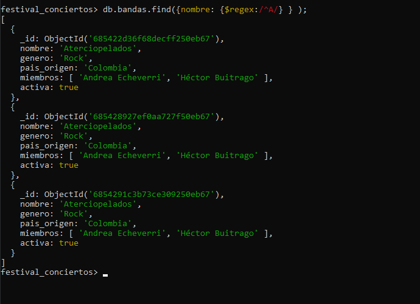

---

### b. Asistentes cuyo nombre contenga "Gómez"

```js
db.asistentes.find({ nombre: { $regex: /Gómez/ } });
```

📌 Busca cualquier asistente que tenga la palabra "Gómez" en su nombre, sin importar en qué posición esté.

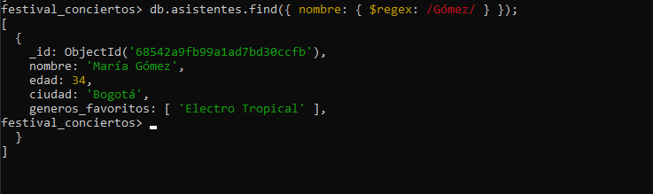

---

## 🧠 2. Operadores de Arreglos

### Asistentes que tengan "Rock" en su campo `generos_favoritos`

```js
db.asistentes.find({ generos_favoritos: "Rock" });
```

📌 MongoDB permite buscar directamente un valor dentro de un array sin usar `$in`.

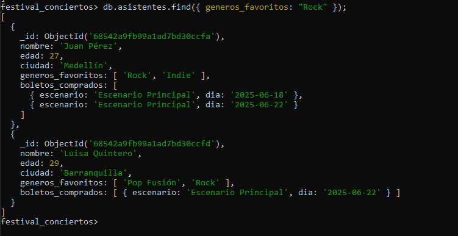

---

## 📊 3. Aggregation Framework

### a. Agrupar presentaciones por escenario y contar cuántas hay por cada uno

```js
db.presentaciones.aggregate([
  { $group: { _id: "$escenario", total_presentaciones: { $sum: 1 } } }
]);
```

📌 Agrupa por el nombre del escenario y suma `1` por cada presentación.

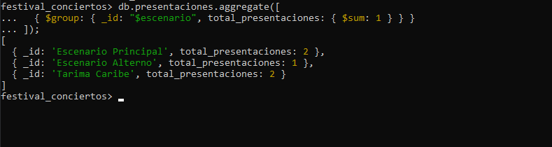

---

### b. Calcular el promedio de duración de las presentaciones

```js
db.presentaciones.aggregate([
  { $group: { _id: null, promedio_duracion: { $avg: "$duracion_minutos" } } }
]);
```

📌 Calcula el promedio de todos los valores en `duracion_minutos`.

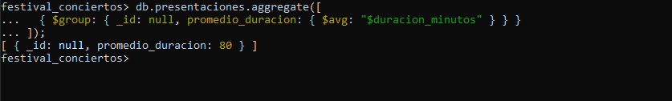

---

## ⚙️ 4. Funciones Simuladas (`system.js`)

Debido a que MongoDB 8.x ya no soporta `db.system.js.save()`, se implementaron como funciones locales en el shell.

### a. escenariosPorCiudad(ciudad)

```js
function escenariosPorCiudad(ciudad) {
  return db.escenarios.find({ ciudad: ciudad }).toArray();
}
escenariosPorCiudad("Bogotá");
```

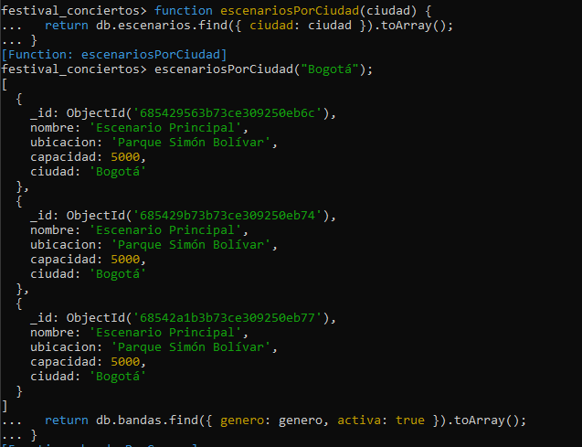

---

### b. bandasPorGenero(genero)

```js
function bandasPorGenero(genero) {
  return db.bandas.find({ genero: genero, activa: true }).toArray();
}
bandasPorGenero("Electro Tropical");
```

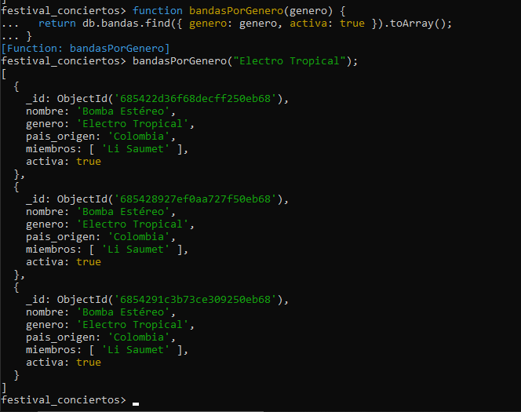

---

## 🔄 5. Simulación de Transacciones

Simuladas manualmente ya que no hay replica set activo.

### 🎟️ a. Compra de boleto

1. Agregar boleto a Carlos Martínez:
```js
db.asistentes.updateOne(
  { nombre: "Carlos Martínez" },
  { $push: { boletos_comprados: { escenario: "Escenario Alterno", dia: "2025-06-22" } } }
);
```
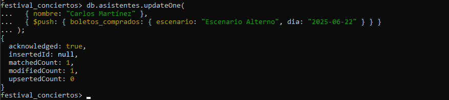

2. Disminuir capacidad del escenario:
```js
db.escenarios.updateOne(
  { nombre: "Escenario Alterno" },
  { $inc: { capacidad: -1 } }
);
```
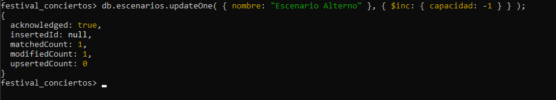

---

### 🔃 b. Reversar compra

1. Eliminar boleto:
```js
db.asistentes.updateOne(
  { nombre: "Carlos Martínez" },
  { $pull: { boletos_comprados: { escenario: "Escenario Alterno", dia: "2025-06-22" } } }
);
```
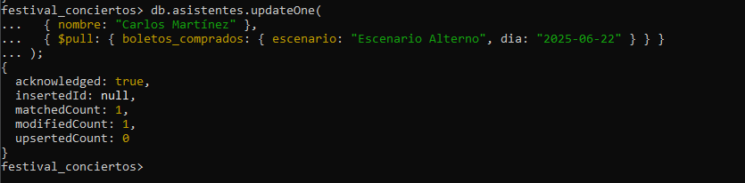

2. Restaurar capacidad:
```js
db.escenarios.updateOne(
  { nombre: "Escenario Alterno" },
  { $inc: { capacidad: 1 } }
);
```
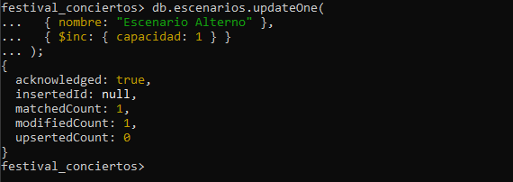

📌 Esto simula una transacción de compra y reversa sin necesidad de entorno transaccional.

---

## 🧱 6. Índices + Consultas

### a. Índice en `bandas.nombre` y búsqueda por nombre

```js
db.bandas.createIndex({ nombre: 1 });
db.bandas.find({ nombre: "Bomba Estéreo" });
```

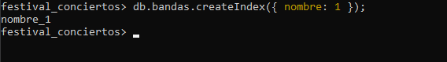
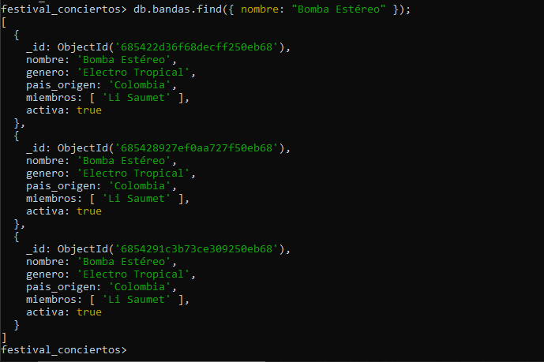

---

### b. Índice en `presentaciones.escenario` y conteo por escenario

```js
db.presentaciones.createIndex({ escenario: 1 });

db.presentaciones.aggregate([
  { $match: { escenario: "Tarima Caribe" } },
  { $count: "total_presentaciones" }
]);
```

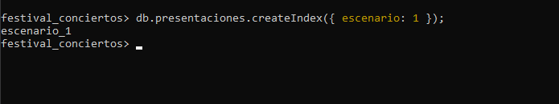
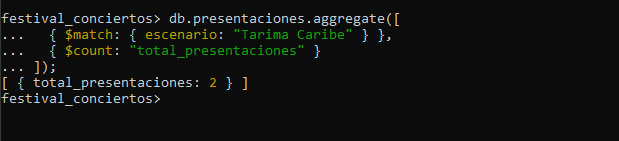

---

### c. Índice compuesto en `asistentes.ciudad` y `edad`

```js
db.asistentes.createIndex({ ciudad: 1, edad: 1 });

db.asistentes.find({
  ciudad: "Bogotá",
  edad: { $lt: 30 }
});
```

📌 Este índice mejora el rendimiento de consultas que filtran por ciudad y edad combinadas.

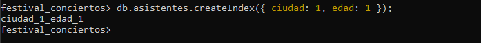
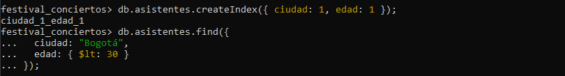

---

## ✅ Conclusión

Este proyecto demuestra cómo aplicar consultas avanzadas, funciones personalizadas, simulación de transacciones e índices en MongoDB para manejar información de un festival musical. ¡Un excelente ejercicio de modelado, optimización y manipulación de datos en bases NoSQL!
